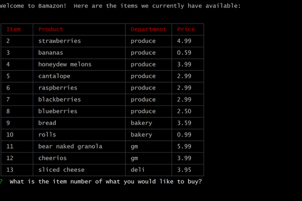
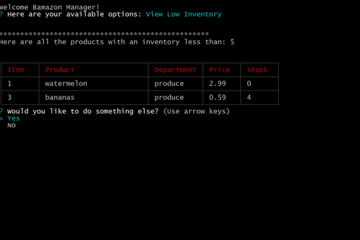

# Bamazon CLI App

## Languages Utilized

Node.js & MySQL

## Packages Utilized

MySQL, Inquirer, CLI-Table2

## Overview

A command line interface program that creates an online store with products populated from a MySQL database. The application includes three separate interfaces for **Customers**, **Managers**, and **Supervisors**. 

### Customer Interface - bamazonCustomer.js

Customers are presented with the items currently available and are prompted to enter the number of what they would like to purchase. 

The customer is then prompted to select what they would like to buy, shown the quantity available and prompted to enter how many they would like. Based on the customer's input, they are presented the total price. 

The database is then updated to reflect the change in inventory and increase the sales for that product.  

### Manager Interface = bamazonManager.js

Managers are presented with 4 different options: 
1. View All Inventory
2. View Low Inventory
3. Add To Inventory
4. Add New Product

**View All Inventory:**
Displays all products including items that are out of stock.  

**View Low Inventory:**
Displays all products with stock less than 5.

**Add To Inventory:**
Prompts the manager to enter an item number that they would like to add inventory to, asks for the number of items being added, and increases the database accordingly.  

**Add New Product:**
Walks the manager through adding a new item. They are prompted to enter the item name, the department, the price, and the initial inventory. The database is updated accordingly.  

### Supervisor Interface - bamazonSupervisor.js

Utilizes two tables in the database - one for products and one for departments.  Supervisors are presented with 2 options:
1. View Sales By Department
2. Create New Department

**View Sales By Department:**
Displays all departments with its overhead expenses, sales, and profit. 

**Create New Department:**
Walks the supervisor through adding a new department. They are prompted to enter the department name and projected overhead. The database is updated accordingly. 